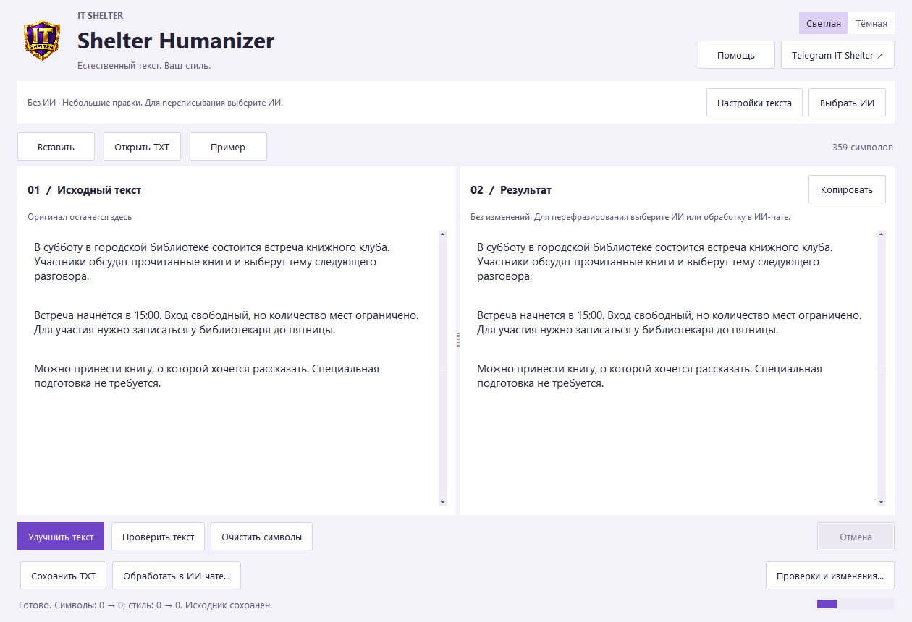
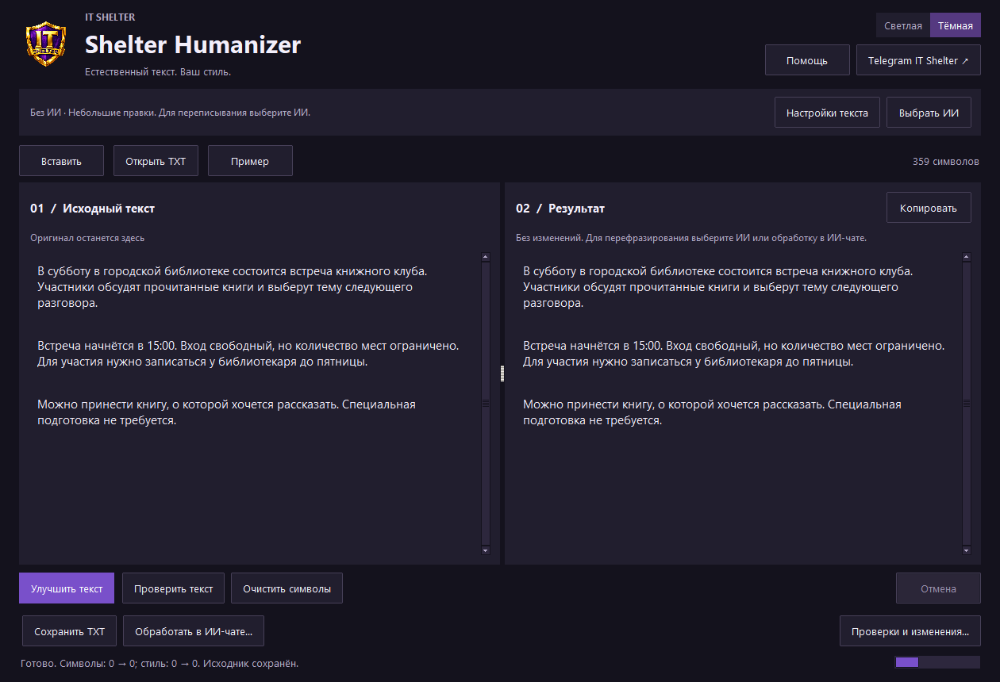

# Shelter Humanizer

**ИИ-редактура текста и очистка скрытых символов — в простом Windows-приложении.**

[English](README_EN.md) · [Скачать для Windows](https://github.com/IT-Shelter-Labs/Shelter-Humanizer/releases/latest) · [Инструкция](docs/QUICKSTART_RU.md) · [Telegram IT Shelter](https://t.me/+txLM4MYbMh9lZDli)

Вставьте текст, нажмите **«Улучшить текст»**, сравните результат и скопируйте его.
Shelter Humanizer помогает убрать шаблонные обороты, тяжёлые формулировки и повторы,
сохраняя содержание. Русский — основной язык редакторских правил; ИИ получает
инструкцию сохранять язык исходника.



## Начать за несколько минут

1. Откройте [Releases](https://github.com/IT-Shelter-Labs/Shelter-Humanizer/releases/latest) и скачайте **`Shelter-Humanizer-1.0.0-windows-x64.zip`** из **Assets**.
2. Распакуйте весь архив в обычную папку. Откройте **`Shelter-Humanizer.exe`** — Python устанавливать не нужно.
3. Для ИИ-редактуры нажмите **«Выбрать ИИ» → «Установить локальный ИИ»**.
4. Выберите модель, нажмите **«Установить и включить ИИ»**, подтвердите загрузку и дождитесь её окончания.
5. Вставьте исходник слева → **«Улучшить текст»** → прочитайте результат справа → **«Копировать»**.

**DeepSeek R1 8B выбран основным вариантом.** На первом запуске мастер скачает
переносимую Ollama (≈1,4 ГБ) и модель (≈5,2 ГБ). Следующие запуски используют
сохранённые файлы; редактирование локальной моделью работает без интернета.
Желательно 24 ГБ оперативной памяти или подходящая видеокарта. Для менее мощного
компьютера есть Qwen 3.5 4B и компактная Qwen 3 1.7B.

Если модель скачивать не хочется, используйте **«Обработать в ИИ-чате…»**:
приложение подготовит задание для вашего ChatGPT или другого чата и поможет
перенести ответ обратно. В режиме **«Без ИИ»** доступны проверка символов,
очистка и небольшие правки по правилам; глубокого переписывания в нём нет.

> Скачивайте ZIP приложения из Assets. Автоматический **Source code (zip)** —
> исходники для разработчиков, без готового EXE. Сборка не подписана сертификатом:
> Windows может показать SmartScreen. Сверьте источник и SHA256; отключать защиту не нужно.

## Что умеет

- **Работа с текстом целиком:** глубокая переработка или небольшие правки, четыре типа текста, образец вашего стиля и важные слова.
- **Сохранение данных:** исходник остаётся слева; во встроенном ИИ-режиме проверяется сохранность распознанных чисел, цитат, ссылок, кода и выбранных терминов.
- **Очистка после ИИ:** после генерации и необязательной вычитки удаляются распознанные нежелательные символы. При вставке ответа из внешнего чата очистка тоже применяется.
- **Проверки и сравнение:** скрытые символы с их кодами и позициями, замечания к стилю и смыслу, список изменений.
- **Удобное окно:** светлая/тёмная темы, копирование рядом с результатом, TXT, явный JSON-экспорт и горячие клавиши в русской/английской раскладках.

Дополнительные параметры находятся в **«Настройках текста»**, а диагностика —
в **«Проверках и изменениях»**. По умолчанию включены переписывание формулировок,
вторая ИИ-вычитка, замена специальных пробелов и нормализация NFC. Замена похожих
латинских букв выключена: она подходит для смешанных русских слов, но может
повредить корректный текст на другом языке.

<details>
<summary>Тёмная тема</summary>



</details>

## Способы обработки

| Способ | Для чего | Что нужно |
| --- | --- | --- |
| **ИИ на компьютере** | Переписывание локальной моделью | Windows-мастер, место на диске и достаточная память |
| **Обработка в ИИ-чате** | Использование уже знакомого чата | Вручную скопировать задание и ответ; API-ключ не нужен |
| **ИИ-сервис по ключу** | Ваш OpenAI-compatible сервис | Адрес, точное имя модели и API-ключ; возможна оплата |
| **Без ИИ** | Символы и осторожная редактура по правилам | Только приложение; без сети |

### Локальные модели

| Модель | Загрузка модели | Ориентир для устройства |
| --- | --- | --- |
| [DeepSeek R1 0528 · Qwen3 8B](https://ollama.com/library/deepseek-r1:8b-0528-qwen3-q4_K_M) | ≈5,2 ГБ | Основной вариант; желательно 24 ГБ RAM или подходящая GPU |
| [Qwen 3.5 4B](https://ollama.com/library/qwen3.5:4b) | ≈3,4 ГБ | Меньше загрузка; желательно 16 ГБ RAM |
| [Qwen 3 1.7B](https://ollama.com/library/qwen3:1.7b) | ≈1,4 ГБ | Короткие простые тексты; желательно 8 ГБ RAM, качество может быть ниже |
| [Qwen 3.5 9B](https://ollama.com/library/qwen3.5:9b) | ≈6,6 ГБ | Желательно 24 ГБ RAM или подходящая GPU |

RAM — ориентир, не измеренный минимум. Размер загрузки не равен потреблению памяти.
DeepSeek R1 0528 — компактный выпуск мая 2025 года, а не новейшая полная серия DeepSeek.
Он сначала рассуждает; в результат попадает только готовый текст. На CPU обработка
может не уложиться в 180 секунд. Начните с короткого текста.

Мастер поддерживает **Windows x64, Windows 10 22H2 и новее**. Он скачивает компоненты
только после подтверждения, проверяет закреплённую SHA256 Ollama и не создаёт
службы или автозапуск. Собственный ИИ выключается при закрытии приложения;
отдельная установка Ollama не затрагивается. Файлы лежат в
`%LOCALAPPDATA%\ShelterHumanizer\ai`. В EXE нет весов моделей.

Своя Ollama или API настраиваются через **«Настроить подключение»**. Для API укажите
базовый адрес, например `https://openrouter.ai/api/v1`, без `/chat/completions`.
[Подробности моделей и промпта](docs/MODELS_AND_PROMPT.md).

## Что означает очистка символов

UTF-8 — кодировка, а не «след ИИ». Кириллица, `ё`, кавычки, тире, ударения и emoji
нормальны и сохраняются. Программа удаляет распознанные невидимые вставки,
мягкий перенос, BOM и некоторые управляющие знаки; специальные пробелы и NFC
обрабатываются согласно настройкам.

**Цитаты, ссылки и код автоматически не очищаются**, чтобы не менять их содержимое.
Во встроенном ИИ-режиме также сохраняются числовое оформление и выбранные термины.
Подозрительные знаки в защищённых участках остаются в отчёте для ручной проверки.
Анализ не является полной реализацией Unicode UTS #39.

## Данные и границы

Локальная модель обрабатывает текст на вашем компьютере. В режиме API выбранный
сервис получает исходник, цитаты, ссылки, код, важные слова и образец стиля.
Приложение не записывает историю текстов или API-ключ автоматически; выбранная
локальная модель сохраняется. JSON-отчёт содержит оба текста и создаётся только
по вашему действию. [Безопасность](SECURITY.md).

Ответы моделей нужно вычитывать. Проверка защищённых фрагментов не доказывает
полное сохранение смысла. Внешний чат использует ручной перенос и сравнение,
без строгой проверки всех защищённых фрагментов встроенного ИИ-режима.

Приложение **не измеряет плагиат или процент уникальности**, не определяет авторство
и не обещает прохождение AI-детекторов. Другие языки зависят от модели;
отдельная проверка качества на них ещё не выполнена.

## Исходники, Linux и CLI

Нужен **Python 3.11+ с Tk**. На Windows Tk входит в обычный установщик Python;
на Debian/Ubuntu установите `python3-tk`. Linux-бинарник не публикуется,
мастер автоматической установки ИИ работает только на Windows.

```bash
git clone https://github.com/IT-Shelter-Labs/Shelter-Humanizer.git
cd Shelter-Humanizer
python launcher.py
```

На Linux используйте `python3`. Для CLI установите пакет в виртуальное окружение:

```bash
python -m pip install -e .
shelter-humanizer analyze examples/post_before.txt -o analysis.json
shelter-humanizer light examples/post_before.txt -o result.txt
shelter-humanizer prompt examples/post_before.txt --depth rephrase -o prompt.txt
shelter-humanizer rewrite examples/post_before.txt --provider ollama --model deepseek-r1:8b-0528-qwen3-q4_K_M -o result.txt
```

Последняя команда требует своей работающей Ollama и установленной модели.
API-ключ передаётся через `SHELTER_API_KEY`. Лимиты: 200 000 символов для анализа,
12 000 для ИИ, 3000 для образца стиля. CLI по умолчанию использует небольшие правки;
для глубокой переработки добавьте `--depth rephrase`.

[Portable skill](skills/shelter-humanizer-ru/SKILL.md) — самостоятельная инструкция
для агента, без GUI и автоматического запуска Unicode-сканера. Скопируйте папку
`skills/shelter-humanizer-ru` в каталог skills вашего агента или попросите прочитать
SKILL.md. Это отдельный вариант использования, не требуется для Windows-приложения.

## Для разработчиков

Runtime-зависимостей из PyPI нет: Tk/ttk и стандартная библиотека Python.
Нет backend, базы, телеметрии и аккаунтов.

```bash
python -m pip install -e .
python -m pip install -r requirements-dev.txt
python -m unittest discover -s tests -v
python -m ruff check .
python -m ruff format --check .
python tools/build_release.py
```

Сборка выполняется на Windows; сборщик проверяет готовый EXE и добавляет лицензии.
GUI-тестам на Linux нужен Xvfb. [Вклад в проект](CONTRIBUTING.md) ·
[Архитектура](docs/ARCHITECTURE.md) · [Оценка качества](docs/EVALUATION.md) ·
[Статус проверок](docs/STATUS.md) · [История версий](CHANGELOG.md).

MIT · [IT Shelter](https://github.com/IT-Shelter-Labs) · [Источники и лицензии](THIRD_PARTY_NOTICES.md)
