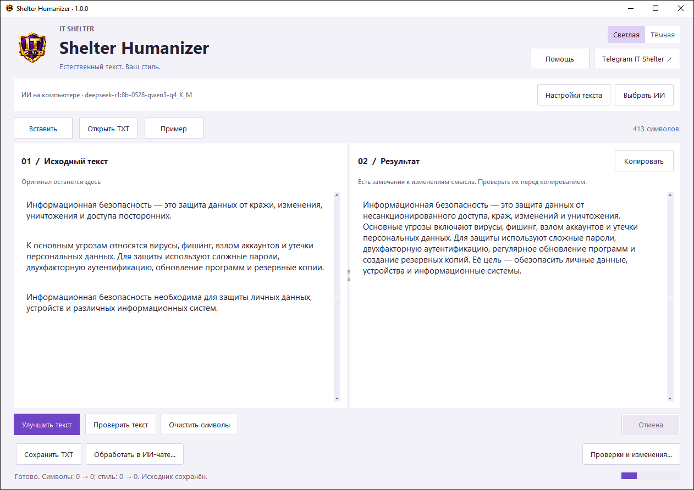
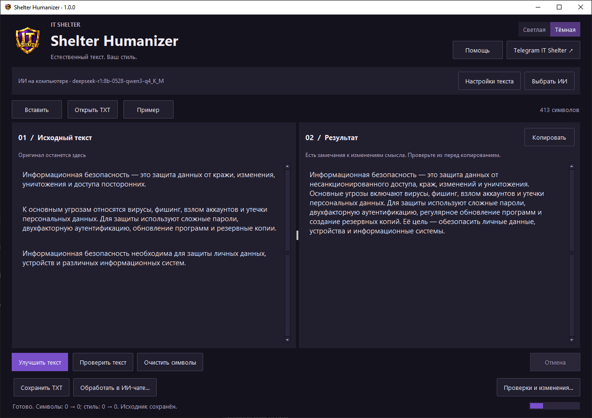

# Shelter Humanizer

**AI text editing and hidden-character cleanup in a simple Windows desktop app.**

[Русский](README.md) · [Download for Windows](https://github.com/IT-Shelter-Labs/Shelter-Humanizer/releases/latest) · [Russian quick start](docs/QUICKSTART_RU.md) · [IT Shelter on Telegram](https://t.me/+txLM4MYbMh9lZDli)

Paste your text, click **«Улучшить текст» (Improve text)**, compare the result, and copy it.
Shelter Humanizer helps remove stock phrases, heavy wording, and repetition while
preserving the content. Russian is the primary editorial profile. The AI is instructed
to keep the input language; quality in other languages has not been separately evaluated.
**The desktop interface is currently in Russian.**



An AI editing example using local DeepSeek R1 8B: source on the left, answer on the right.
The app also displays meaning-review warnings to check before copying.

<details>
<summary>Dark theme</summary>



</details>

## Quick start on Windows

1. Open [Releases](https://github.com/IT-Shelter-Labs/Shelter-Humanizer/releases/latest). Under **Assets**, download **`Shelter-Humanizer-1.0.0-windows-x64.zip`**.
2. Extract the entire ZIP, then open **`Shelter-Humanizer.exe`**. You do not need to install Python.
3. For AI editing, select **«Выбрать ИИ» (Choose AI) → «Установить локальный ИИ» (Install local AI)**.
4. Select a model, click **«Установить и включить ИИ» (Install and enable AI)**, confirm, and wait for the download.
5. Paste the source on the left → **«Улучшить текст»** → review the right pane → **«Копировать» (Copy)**.

**Qwen 3.5 4B (`qwen3.5:4b`) is the default model in the installer.** After confirmation,
setup downloads portable Ollama (about 1.4 GB) and the model (about 3.4 GB).
After setup, local editing works without internet. Prefer 16 GB RAM. Qwen 3 1.7B
is a smaller option. DeepSeek R1 8B remains available; saved selections are preserved.
Hardware guidance is approximate, not a measured minimum.

These defaults apply to current `main` after the initial 1.0.0 release. The original
1.0.0 archive defaults to DeepSeek; the updated build needs a separate release.

Do not want to download a model? **«Обработать в ИИ-чате…» (Process in an AI chat)**
prepares a task for your existing ChatGPT or another chat. Copy the task and paste
the answer back manually; no API key is required.

**«Без ИИ» (Without AI)** provides offline character checks, cleanup, and limited
rule-based edits. It does not deeply rewrite text. Good text may remain unchanged.

> Download the application ZIP from Assets. GitHub's automatic **Source code (zip)**
> contains source files, not the executable. The Windows build is unsigned and may
> trigger SmartScreen; check the source and SHA256 rather than disabling protection.

## Features

- Whole-text rewriting or light editing, four genres, a style sample, and protected terms.
- Source and result side by side; checks for changes to recognized numbers, quotations, URLs, code, and explicit terms in integrated AI mode.
- Cleanup **after AI generation and optional proofreading**, also applied when pasting an external chat answer.
- Hidden-character positions and code points, style notes, change comparison, and meaning-review warnings.
- Light/dark themes, copy beside the result, TXT import/export, explicit JSON reports, and Russian/English keyboard-layout shortcuts.

Advanced controls live in **«Настройки текста» (Text settings)**. Diagnostics are
under **«Проверки и изменения» (Checks and changes)**. Light editing, a second
AI proofreading pass, special-space replacement, and NFC are enabled by default.
Latin-lookalike replacement is off because it can damage legitimate multilingual text.

The [Russian prompt comparison](docs/PROMPT_EVALUATION_2026-10-04.md) documents
the current instruction, four local models, blinded machine judgments and study limitations.

## Processing choices

| Mode | Purpose | Requirements |
| --- | --- | --- |
| Local AI | Rewrite on your computer | Windows setup wizard, disk space, adequate memory |
| Existing AI chat | Use a familiar chat | Manually copy the task and answer |
| API | Use your OpenAI-compatible service | Base URL, model ID, API key; service fees may apply |
| Without AI | Character inspection and limited edits | App only, no network |

### Model presets

| Model | Approximate download | Device guidance |
| --- | --- | --- |
| [Qwen 3.5 4B](https://ollama.com/library/qwen3.5:4b) | 3.4 GB | Default; preferably 16 GB RAM |
| [DeepSeek R1 0528 · Qwen3 8B](https://ollama.com/library/deepseek-r1:8b-0528-qwen3-q4_K_M) | 5.2 GB | Alternative; preferably 24 GB RAM or a suitable GPU |
| [Qwen 3 1.7B](https://ollama.com/library/qwen3:1.7b) | 1.4 GB | Short simple texts; preferably 8 GB RAM; quality may be lower |
| [Qwen 3.5 9B](https://ollama.com/library/qwen3.5:9b) | 6.6 GB | Preferably 24 GB RAM or a suitable GPU |

DeepSeek R1 0528 is the compact May 2025 release, not the newest full DeepSeek
series. It reasons before answering; only the final answer becomes edited text.
CPU generation may exceed the integrated local request timeout of 180 seconds.
Start with short input. Model size is not RAM usage or a quality guarantee.

The installer supports **Windows x64, Windows 10 22H2 or newer**. It downloads
components only after confirmation, verifies the pinned Ollama SHA256, and adds
no services or startup entries. Its own AI process closes with the app; your
separate Ollama installation is unaffected. Files live in
`%LOCALAPPDATA%\ShelterHumanizer\ai`. Model weights are not bundled in the EXE.

Use **«Настроить подключение» (Configure connection)** for your own Ollama or API.
For API, enter a base URL such as `https://openrouter.ai/api/v1`, without
`/chat/completions`. [Model and prompt details](docs/MODELS_AND_PROMPT.md) (Russian).

## Unicode cleanup and data

UTF-8 is an encoding, not an AI fingerprint. Cyrillic letters, quotation marks,
dashes, accents, and emoji are valid text and are preserved. Cleanup targets
recognized unwanted invisible insertions, BOM, soft hyphens, and certain controls.
Special spaces and NFC follow the selected settings.

Quotations, URLs, and code are not automatically cleaned; integrated AI mode also
preserves numeric typography and explicit terms. Findings inside protected spans
remain visible for manual review. This is not a full implementation of Unicode UTS #39.

Local AI processes text on your computer. In API mode, the selected service receives
the full readable text and style sample, including protected content. No automatic
text history or API-key storage is created. The local model selection is saved.
Explicit JSON reports include both texts. [Security](SECURITY.md) (Russian).

Always review the answer. Protected-fragment checks do not prove semantic equivalence.
Manual chat import compares texts but does not apply every strict integrated-AI guard.
The app does not measure plagiarism, internet uniqueness, or authorship, and does not
guarantee passing AI detectors.

## Source, Linux, and CLI

Requires **Python 3.11+ with Tk**. Windows Python installers normally include Tk;
on Debian/Ubuntu install `python3-tk`. Linux binaries are not provided. Automatic
AI installation is Windows-only; on Linux configure your own local server.

```bash
git clone https://github.com/IT-Shelter-Labs/Shelter-Humanizer.git
cd Shelter-Humanizer
python launcher.py
```

Use `python3` on Linux. For CLI, install in a virtual environment:

```bash
python -m pip install -e .
shelter-humanizer analyze examples/post_before.txt -o analysis.json
shelter-humanizer light examples/post_before.txt -o result.txt
shelter-humanizer prompt examples/post_before.txt --depth rephrase -o prompt.txt
shelter-humanizer rewrite examples/post_before.txt --provider ollama --model qwen3.5:4b --depth rephrase -o result.txt
```

The last command needs a running Ollama with that model installed. API keys are read
from `SHELTER_API_KEY`. Limits: 200,000 characters for analysis, 12,000 for AI,
and 3,000 for a style sample. CLI defaults to light editing; use `--depth rephrase`
for deeper rewriting.

The [portable skill](skills/shelter-humanizer-ru/SKILL.md) is a separate editorial
instruction for an agent. Copy the entire `skills/shelter-humanizer-ru` folder into
your agent's skills directory or ask the agent to read SKILL.md. It needs no GUI
and does not automatically run the Unicode scanner. Native agent discovery has
not been separately validated.

## Development

No third-party runtime dependencies: Python standard library and Tk/ttk.
No backend, database, telemetry, or accounts.

```bash
python -m pip install -e .
python -m pip install -r requirements-dev.txt
python -m unittest discover -s tests -v
python -m ruff check .
python -m ruff format --check .
python tools/build_release.py
```

Build on Windows. The packager runs an executable self-test and bundles runtime
licenses. Linux GUI tests require a display or Xvfb.

[Contributing](CONTRIBUTING.md) · [Architecture](docs/ARCHITECTURE.md) ·
[Evaluation](docs/EVALUATION.md) · [Validation status](docs/STATUS.md) · [Changelog](CHANGELOG.md).

MIT · [IT Shelter](https://github.com/IT-Shelter-Labs) · [Sources and licenses](THIRD_PARTY_NOTICES.md)
